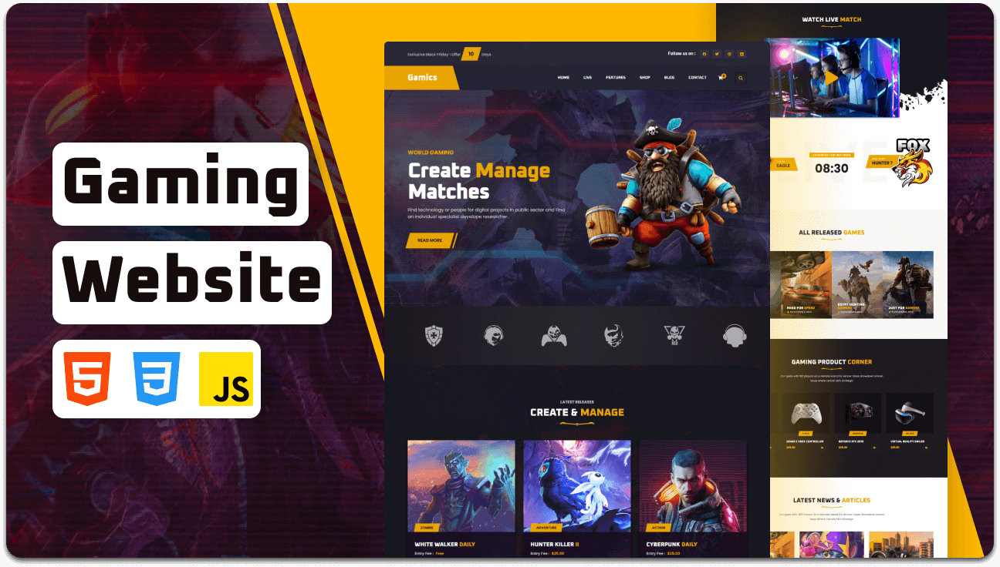

### Prerequisites

Before you begin, ensure you have met the following requirements:
# GIGAQUIZ 🎮

GIGAQUIZ is an interactive web-based quiz gaming platform where users can log in, attempt quizzes, and track their performance through a leaderboard. The application provides a fun and engaging way for users to test their knowledge with dynamic quiz questions and real-time score tracking.

## 🚀 Live Demo

https://incredible-marigold-891f59.netlify.app/

## ✨ Features

* User login system
* Interactive quiz interface
* Dynamic question rendering using JavaScript
* Automatic score calculation
* Leaderboard to track user rankings
* Responsive UI for better user experience

## 🛠️ Tech Stack

* HTML5
* CSS3
* JavaScript

## 📂 Pages Included

* Home Page
* Login Page
* Quiz Page
* Leaderboard
* Contact / About Page

